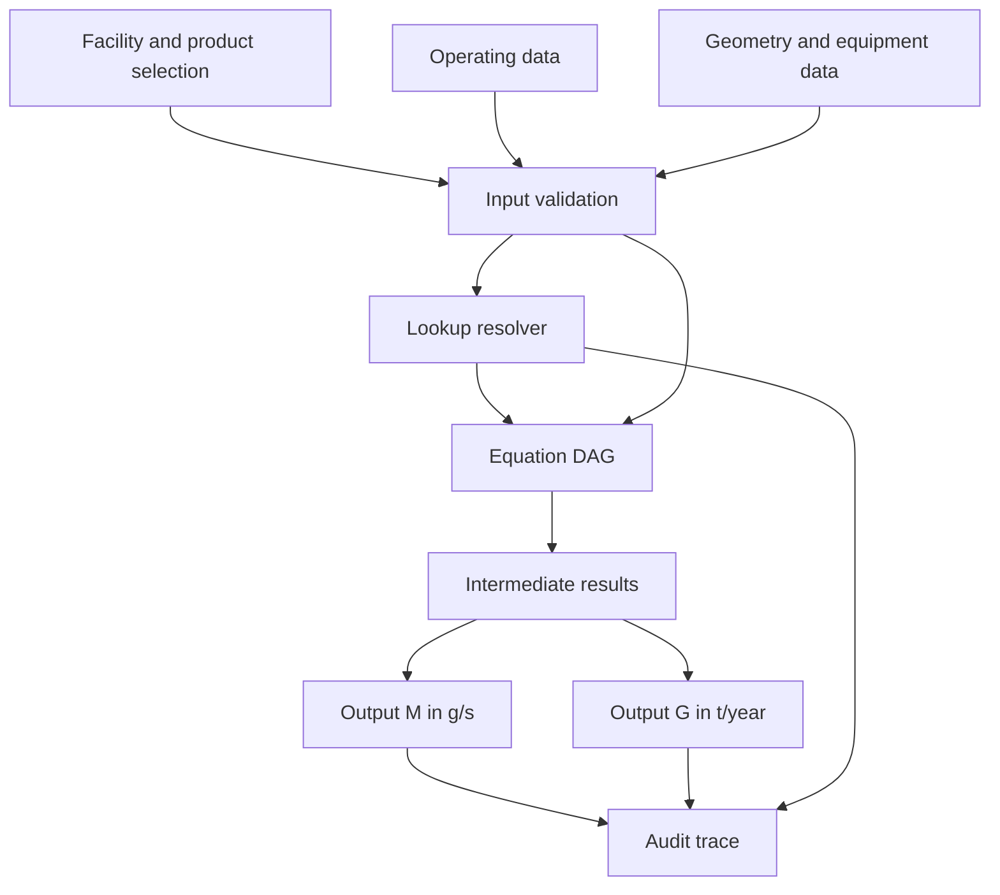
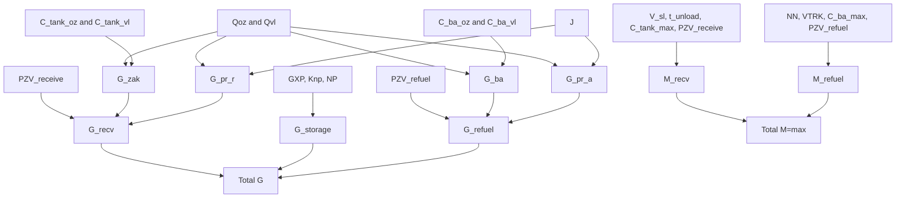

# 2011 Fuel Stations Equation Architecture Schema

Source PDF: `2011_fuel_stations.pdf`

This guide explains the big picture behind the equations in Order 196-oe: what each equation is trying to calculate, why the variables exist, how equations depend on one another, and how to build a calculation system without blindly copying formulas.

The PDF is a methodology for estimating emissions from enterprises that store and sell petroleum products, other liquids, and gases. In the repo, the implemented equation modules live under `data/methodics/fuel_stations_2011/section_*`.

Important implementation note: some formulas in the PDF are embedded visually and do not extract cleanly as text. The exact runtime formulas below come from the package JSON files. Where the runtime model intentionally adapts the source, that is called out.

## 1. Mental Model

Do not start from an equation. Start from the emission source.

For every calculation, answer these questions first:

1. What physical source emits vapor or gas?
2. Do we need a maximum rate `M`, an annual mass `G`, or both?
3. What activity amount drives the emission: flow, throughput, area, equipment count, operating time, or number of tanks?
4. What describes the material volatility: vapor pressure, vapor concentration, Henry constant, specific emission factor, or table value?
5. What correction factors apply: temperature, pressure, tank construction, turnover, emission control, cover, or composition?
6. Does the result stand alone, get summed into annual total `G`, or compete with another peak source for maximum `M`?

## 2. Core Outputs

`M` means maximum one-time emission rate, normally in `g/s`.

Use `M` for peak operating cases, source rate reporting, and dispersion inputs. It usually uses worst-case or maximum values: maximum concentration, maximum vapor flow, maximum temperature, maximum simultaneous equipment, or maximum discharge pressure.

`G` means annual emission mass, normally in `t/year`.

Use `G` for annual inventory and permit totals. It usually uses annual or seasonal throughput, operating hours, storage time, or number of events.

Aggregation rule:

- Sum `G` across independent annual sources.
- Sum `M` only when sources can operate at the same time.
- Use `max(M_a, M_b)` when the methodology says operations are not simultaneous. The current `7.1_combined` module uses `max(M_recv, M_refuel)` because receiving fuel into station tanks and refueling vehicles are normally not simultaneous in the PDF logic.

## 3. System Architecture



Recommended layers:

- Input layer: facility choices, product, climate zone, tank type, throughput, flow, time, counts, area.
- Lookup layer: resolves table-backed values such as concentrations, coefficients, vapor pressure, and specific emissions.
- Equation layer: evaluates formula nodes in dependency order.
- Aggregation layer: combines branch outputs using source-specific rules.
- Audit layer: records selected tables, input values, equations, source page, units, and final outputs.

## 4. Method Selection

| Module | Use when | Main outputs |
|---|---|---|
| `4.2_oil_gasoline_r38` | Oil/gasoline tank emissions where vapor pressure at 38 C (`P38_src`) is the volatility basis. | `M`, `G` |
| `4.3_pure_substance` | Tank emissions from an individual pure liquid substance. | `M`, `G` |
| `4.4_known_mixture` | Tank emissions from a known liquid mixture; calculate by component `i`. | `M`, `G` per component |
| `4.5_gas_in_water` | Gas emissions from water solutions; Henry constant is the volatility basis. | `M`, `G` |
| `4.6_other_products_c20` | Other petroleum products where concentration at 20 C (`C20`) is the basis. | `M`, `G` |
| `5.2_depot_tanks` | Petroleum depot tank emissions using table-based concentrations and specific seasonal emissions. | `M`, `G` |
| `6.1_flanges` | Unorganized emissions from flanges/fittings modeled by seasonal specific emission factors. | `G` runtime, `M=0` |
| `6.2_equipment` | Leaks from equipment such as pumps/compressors using a specific emission rate. | `M`, `G` |
| `6.4_relief_valves` | Relief valve gas discharge event. | `M` runtime, `G=0` |
| `6.5_wastewater` | Open wastewater treatment surfaces. | `M`, `G` |
| `6.6_sludge` | Sludge accumulators/open mazut pits. | `M`, `G` |
| `7.1_receive` | Fuel station receiving/unloading liquid product into tanks. | `M`, `G` |
| `7.1_refuel` | Fuel station refueling vehicles through dispensers. | `M`, `G` |
| `7.1_storage` | Fuel station annual storage emissions. | `G`, derived average `M` |
| `7.1_combined` | Full liquid fuel station total: receiving + storage + vehicle refueling. | `M`, `G` |
| `7.2_gas` | Automotive gas filling station release from filling/purging events. | `M`, `G` |

## 5. Variable Families

| Family | Variables | Why they exist |
|---|---|---|
| Result variables | `M`, `G` | Every module ultimately reports peak rate and/or annual mass. |
| Seasonal activity | `B_oz`, `B_vl`, `Qoz`, `Qvl` | Annual emissions depend on season because concentration and temperature differ between autumn-winter and spring-summer. |
| Annual activity | `B_year`, `equipHours`, `N_gas`, `NP` | Converts per-event or per-unit emissions into an annual total. |
| Peak flow/activity | `Vch_max`, `V_sl`, `t_unload`, `VTRK`, `NN`, `n_gas`, `F_gas`, `H_gas` | Peak `M` is driven by the highest instantaneous displacement or release rate. |
| Geometry/surface | `F_area`, `V_nom`, `tank_volume_cat` | Surface and tank size affect evaporation area, table lookup, or emission scaling. |
| Volatility/concentration | `P38_src`, `Pt_max`, `Pt_min`, `Kg_max`, `Kg_min`, `C20`, `C1`, `C_tank_*`, `C_ba_*`, `q_sr`, `GXP` | These represent how much pollutant is available in the vapor phase. Without them, activity volume cannot be converted into mass emitted. |
| Product composition | `m_vapor`, `m_pure`, `X_i`, `sum_Xi_mi`, `sum_Xi_rhoi`, `c_ij_mass` | Needed when the pollutant mass depends on molecular mass, mixture composition, or pollutant fraction. |
| Correction factors | `Kt_*`, `Kp_*`, `Kv`, `Kob`, `Knp`, `z_coeff`, `phi_i_valve` | Adjust base emission intensity for temperature, pressure, tank design, turnover, storage loss, cover, or gas behavior. |
| Control/recovery | `PZV_receive`, `PZV_refuel` | Runtime adaptation for vapor recovery or emission reduction. Applied to generated vapor terms, not spill terms. |
| Spill terms | `J` | Converts liquid handled to additional vapor from spills or liquid film on hoses. |
| Unit conversion constants | `3600`, `0.000001`, `31.536`, `2592`, `0.001` | Convert hours to seconds, grams to tonnes, kg/month to g/s, and annual seconds to tonnes/year. These constants are part of the unit logic, not arbitrary coefficients. |

## 6. Lookup Tables

Keep lookups separate from equations. A lookup produces a variable; an equation consumes that variable.

| Table | Produces | Used for |
|---|---|---|
| `Table_App_4` | `Kg_min`, `Kg_max` | Henry constants for gases in water. |
| `Table_App_5` | `m_vapor` | Vapor molecular mass for oil/gasoline style calculations. |
| `Table_App_7` | `Kt_min`, `Kt_max` | Temperature correction coefficients. |
| `Table_App_8` | `Kp_avg`, `Kp_max` | Tank design/pressure correction coefficients. |
| `Table_App_9` | `Kv` | Vapor pressure correction. |
| `Table_App_10` | `Kob` | Tank turnover correction. |
| `Table_App_16` | `Pt_min`, `Pt_max` | Pure substance vapor pressure at temperature. |
| `Table_12` | `C1`, `Uoz`, `Uvl`, `Knp` | Concentration, seasonal specific emission, and storage correction by product/climate. |
| `Table_15_tank` | `C_tank_max`, `C_tank_oz`, `C_tank_vl` | Vapor concentrations during filling station tank receiving. |
| `Table_15_vehicle` | `C_ba_oz`, `C_ba_vl` | Vapor concentrations during vehicle tank filling. |
| `Table_Appendix_13` | `GXP` | Storage emission per tank category. |
| `Table_Spill_J` | `J` | Spill emission factor by product. |
| `Table_6_1` | `Q_spec` | Specific equipment leakage rate. |
| `Table_6_3` | `q_sr` | Open wastewater surface emission rate. |
| `Table_6_4` | `z_coeff` | Open surface cover reduction coefficient. |
| `Table_6_5` | `n_surface_norm`, `n1_norm`, `n2_norm` | Natural loss norms for sludge/open mazut surfaces. |

## 7. Equation Graph For Liquid Fuel Stations

The `7.1_combined` module is the clearest example of equation relationships.



Why the branches exist:

- Receiving branch: emissions while fuel is unloaded into station tanks.
- Storage branch: annual breathing/standing storage emissions.
- Refueling branch: emissions while customer vehicle tanks are filled.
- Spill sub-branches: separate because vapor recovery usually does not remove spill evaporation.
- Combined annual `G`: sum all annual masses.
- Combined maximum `M`: use the maximum of receiving/refueling peaks unless the implementation explicitly supports simultaneous operation.

## 8. Runtime Equation Catalog

### 4.2 Oil/Gasoline By `P38_src`

Purpose: estimate tank emissions for oil/gasoline products when the volatility basis is vapor pressure at 38 C.

Equations:

```text
M = 0.163 * P38_src * m_vapor * Kt_max * Kp_max * Kv * Vch_max / 10000
G_422 = 0.294 * P38_src * m_vapor * Kt_min * Kv * Kp_avg * Kob * B_oz / (10000000 * rho_liq)
G_423 = 0.294 * P38_src * m_vapor * Kt_max * Kp_avg * Kob * B_vl / (10000000 * rho_liq)
G = G_422 + G_423
```

Read it as:

- `P38_src` and `m_vapor` describe how volatile/heavy the vapor is.
- `Kt_*`, `Kp_*`, `Kv`, `Kob` correct the base vapor generation for temperature, pressure/design, vapor pressure, and tank turnover.
- `Vch_max` drives peak rate `M`.
- `B_oz` and `B_vl` drive annual mass by season.
- `rho_liq` converts handled liquid mass/volume basis correctly.

### 4.3 Pure Substance

Purpose: estimate tank emissions for one known pure substance.

Equations:

```text
M = 0.445 * Pt_max * m_pure * Kp_max * Kv * Vch_max / (100 * (273 + t_liq_max))
G = 0.160 * (Pt_min * Kv + Pt_max) * m_pure * Kp_avg * Kob * B_year / (10000 * rho_liq * (546 + t_liq_min + t_liq_max))
```

Read it as:

- `Pt_max` and `Pt_min` are vapor pressures at maximum/minimum liquid temperatures.
- `m_pure` converts moles/pressure behavior into mass.
- `273 + t` terms are absolute temperature corrections.
- `B_year` drives annual throughput.

### 4.4 Known Mixture

Purpose: estimate emissions of component `i` from a liquid mixture with known composition.

Equations:

```text
M = 0.445 * Pt_i_max * X_i * Kp_max * Kv * Vch_max / (100 * sum_Xi_mi * (273 + t_liq_max))
G = 0.16 * (Pt_i_min * Kv + Pt_i_max) * X_i * Kp_avg * Kob * B_year * sum_Xi_rhoi / (10000 * sum_Xi_mi * (546 + t_liq_min + t_liq_max))
```

Read it as:

- Run this per pollutant/component `i`.
- `Pt_i_*` is the component vapor pressure.
- `X_i` is the component mass fraction.
- `sum_Xi_mi` and `sum_Xi_rhoi` normalize the mixture behavior.
- This module answers: "How much of component `i` leaves the mixture?"

### 4.5 Gas In Water

Purpose: estimate emissions of gas dissolved in water.

Equations:

```text
M = 0.08 * Kg_max * X_i * Kp_max * Vch_max / (273 + t_liq_max)
G = 0.289 * (Kg_min + Kg_max) * X_i * Kp_avg * Vch_max * t_oper_days * t_oper_hours / (1000 * (546 + t_liq_min + t_liq_max))
```

Read it as:

- `Kg_*` is Henry constant; it replaces vapor pressure as the volatility driver.
- `X_i` is gas concentration/fraction in water.
- `t_oper_days` and `t_oper_hours` turn a rate into annual mass.

### 4.6 Other Products By `C20`

Purpose: estimate emissions for products where vapor concentration at 20 C is the available basis.

Equations:

```text
M = C20 * Kt_max * Kp_max * Vch_max / 3600
G_462 = C20_l * Kt_max * Kp_avg * Kob * B_vl / (1000000 * rho_liq)
G_463 = C20_z * Kt_min * Kp_avg * Kob * B_oz / (1000000 * rho_liq)
G = G_462 + G_463
```

Read it as:

- `C20`, `C20_l`, and `C20_z` are concentration inputs for maximum/summer/winter cases.
- `3600` converts hourly vapor volume flow into seconds for `M`.
- Seasonal `G` is still split into `vl` and `oz` branches.

### 5.2 Depot Tanks

Purpose: estimate emissions from petroleum depot tanks using specific emission and storage table values.

Equations:

```text
M = C1 * Kp_max * Vch_max / 3600
G = (Uoz * B_oz + Uvl * B_vl) * Kp_avg * 0.000001 + Ghr * Knp * NP
```

Read it as:

- `C1` converts displaced vapor flow into peak mass rate.
- `Uoz` and `Uvl` are seasonal specific emissions.
- `Ghr * Knp * NP` adds storage/breathing emissions across tanks.

### 6.1 Flanges And Fittings

Purpose: estimate unorganized annual emissions modeled through seasonal specific rates.

Equations:

```text
M = 0
G = (Uoz * B_oz + Uvl * B_vl) * Kp_avg * 0.000001
```

Read it as:

- Runtime package does not model a peak `M` for this branch.
- Annual mass is seasonal specific emission times throughput, corrected by `Kp_avg`.

### 6.2 Equipment

Purpose: estimate leaks from equipment using a specific emission rate.

Equations:

```text
M = Q_spec * equipCount / 3.6
G = Q_spec * equipCount * equipHours * 0.001
```

Read it as:

- `Q_spec` is the table-backed leakage rate per equipment unit.
- `equipCount` scales from one unit to all units.
- `equipHours` turns the rate into annual mass.
- `3.6` and `0.001` are unit conversions.

### 6.4 Relief Valves

Purpose: estimate peak emission from a relief valve discharge.

Equations:

```text
G_i = 0.061 * f_i_valve * P_i_valve * phi_i_valve * pow(M_i_mol / T_i_valve, 0.5)
M = 0.2778 * G_i * n_i_valve * c_ij_mass / 100
G = 0
```

Read it as:

- `G_i` is an intermediate gas discharge flow.
- `M` converts discharge flow to pollutant mass rate using number of valves and pollutant mass concentration.
- Runtime package treats this as an event peak only; annual `G` is not calculated here.

### 6.5 Wastewater/Open Treatment Surfaces

Purpose: estimate evaporation from open wastewater treatment surfaces.

Equations:

```text
M = q_sr * F_area * z_coeff
G = M * 31.536
```

Read it as:

- Runtime `q_sr` is modeled as `g/(s*m2)`.
- `F_area` scales the rate by open surface area.
- `z_coeff` reduces emissions when the surface is covered.
- `31.536` equals `8760 * 3600 / 1e6`, converting continuous `g/s` to `t/year`.

### 6.6 Sludge/Open Mazut Pits

Purpose: estimate emissions from sludge accumulators or open mazut pits using natural loss norms.

Equations:

```text
M = n_surface_norm * F_area / 2592
G = 6 * F_area * (n1_norm + n2_norm) * 0.001
```

Read it as:

- `n_surface_norm` is a monthly surface loss norm for the peak season.
- `2592` converts `kg/(m2*month)` to `g/s` for a 30-day month.
- Annual `G` assumes 6 months per seasonal norm.

### 7.1 Receiving Fuel Into Station Tanks

Purpose: emissions while liquid product is unloaded into fuel station storage tanks.

Equations:

```text
M = ((C_tank_max * V_sl) / t_unload) * (1 - PZV_receive/100)
G_zak = (C_tank_oz * Qoz + C_tank_vl * Qvl) * 0.000001
G_pr_r = 0.5 * J * (Qoz + Qvl) * 0.000001
G = G_zak * (1 - PZV_receive/100) + G_pr_r
```

Read it as:

- `V_sl / t_unload` is the actual receiving flow rate.
- `C_tank_max` produces peak receiving vapor mass.
- `C_tank_oz` and `C_tank_vl` produce seasonal annual vapor mass.
- `PZV_receive` reduces captured/recovered vapor emissions.
- `G_pr_r` is spill/hose loss during receiving and is added separately.

### 7.1 Refueling Vehicles

Purpose: emissions while fuel is dispensed into vehicle tanks.

Equations:

```text
M = ((NN * VTRK * C_ba_max) / 3600) * (1 - PZV_refuel/100)
G_ba = (C_ba_oz * Qoz + C_ba_vl * Qvl) * 0.000001
G_pr_a = 0.5 * J * (Qoz + Qvl) * 0.000001
G = G_ba * (1 - PZV_refuel/100) + G_pr_a
```

Read it as:

- `VTRK` is one dispenser hose flow.
- `NN` scales one hose to simultaneously operating hoses.
- `C_ba_max` is the maximum vapor concentration while filling vehicle tanks.
- `C_ba_oz` and `C_ba_vl` are seasonal vehicle tank filling concentrations.
- `G_pr_a` accounts for spill/film evaporation from refueling hoses.

### 7.1 Storage At Fuel Station

Purpose: annual storage emissions from fuel station tanks.

Equations:

```text
G = GXP * Knp * NP
M = G * 1000000 / (8760 * 3600)
```

Read it as:

- `GXP` is a table value for storage emission per tank/category.
- `Knp` corrects for product/climate.
- `NP` is number of tanks.
- Runtime `M` is an average rate derived from annual `G`, not an independent peak source formula.

### 7.1 Combined Liquid Fuel Station

Purpose: full liquid fuel station total.

Equations:

```text
M_recv = ((C_tank_max * V_sl) / t_unload) * (1 - PZV_receive/100)
G_zak = (C_tank_oz * Qoz + C_tank_vl * Qvl) * 0.000001
G_pr_r = 0.5 * J * (Qoz + Qvl) * 0.000001
G_recv = G_zak * (1 - PZV_receive/100) + G_pr_r
G_storage = GXP * Knp * NP
M_refuel = ((NN * VTRK * C_ba_max) / 3600) * (1 - PZV_refuel/100)
G_ba = (C_ba_oz * Qoz + C_ba_vl * Qvl) * 0.000001
G_pr_a = 0.5 * J * (Qoz + Qvl) * 0.000001
G_refuel = G_ba * (1 - PZV_refuel/100) + G_pr_a
M = max(M_recv, M_refuel)
G = G_recv + G_storage + G_refuel
```

Read it as:

- This is not a new physical equation; it is an aggregation of receiving, storage, and refueling.
- Annual emissions are additive.
- Peak emissions use maximum branch selection because the PDF notes simultaneous receiving and vehicle refueling usually does not occur.

### 7.2 Automotive Gas Filling Stations

Purpose: estimate gas release during vehicle cylinder filling or purging.

Equations:

```text
M = mu_coeff * rho_gas * n_gas * F_gas * pow(2 * 9.81 * H_gas, 0.5) * 1000
G = (M * tau_gas / n_gas) * N_gas * 0.000001
```

Read it as:

- This is an orifice/discharge style formula.
- `mu_coeff` is discharge coefficient.
- `rho_gas` converts release volume to mass.
- `n_gas` is simultaneous filling/purging points for peak `M`.
- `F_gas` and `H_gas` control discharge rate.
- `tau_gas` and `N_gas` turn event emissions into annual mass.

## 9. Source Equation Anchors

| Source equation | Runtime node(s) | PDF page in package metadata |
|---|---|---|
| `4.2.1` | `M` | 17 |
| `4.2.2`, `4.2.3` | `G_422`, `G_423`, `G` | 17 |
| `4.3.1`, `4.3.2` | `M`, `G` | 18 |
| `4.4.1`, `4.4.2` | `M`, `G` | 18 |
| `4.5.1`, `4.5.2` | `M`, `G` | 19 |
| `4.6.1`, `4.6.2`, `4.6.3` | `M`, `G_462`, `G_463`, `G` | 20 |
| `5.2.1`, `5.2.2` | `M`, `G` | 21 |
| `6.1.1` | `G` | 22 |
| `6.2.1`, `6.2.2` | `M`, `G` | 23 |
| `6.4.2`, `6.4.3` | `G_i`, `M` | 28 |
| `6.5.1`, `6.5.2` | `M`, `G` | 29 |
| `6.6.1`, `6.6.2` | `M`, `G` | 30 |
| `7.1.1` | `M_recv` / receiving `M` | 31 |
| `7.1.2` | `M_refuel` / refueling `M` | 32 |
| `7.1.3`, `7.1.4`, `7.1.5` | receiving annual branch | 31, 33 |
| `7.1.6`, `7.1.7`, `7.1.8` | refueling annual branch | 33 |
| `7.1.9` | combined annual `G` | 33 |
| `7.2.1`, `7.2.2` | gas station `M`, `G` | 34 |

## 10. Implementation Schema

A robust system should model formulas as a dependency graph, not as one long function.

Suggested data model:

```yaml
method_package:
  id: fuel_stations_2011
  source_pdf: reference/2011_fuel_stations.pdf
  modules:
    - id: 7.1_combined
      inputs:
        - user-entered variables
        - selector variables
      lookups:
        - target variable
        - table id
        - selectors
        - axis input
      equations:
        - lhs token
        - rhs expression
        - source equation ids
        - unit id
      outputs:
        - M
        - G
      aggregation_rule:
        M: max of non-simultaneous peak branches
        G: sum of annual branches
```

Execution order:

1. Select the module from the physical source.
2. Validate all user inputs and selectors.
3. Resolve lookup variables from tables.
4. Normalize units before equation evaluation.
5. Evaluate equations topologically: inputs and lookups first, intermediate nodes next, final outputs last.
6. Apply aggregation rules.
7. Return audit trace with source equation ids, table rows, variables, units, and outputs.

## 11. Unit And Validation Rules

Minimum validation rules:

- Activity values cannot be negative.
- Percent efficiencies such as `PZV_receive` and `PZV_refuel` must be within allowed range, normally `0..100`.
- Seasonal values should be internally consistent: `B_oz + B_vl` should match `B_year` when both are supplied; same idea for `Qoz + Qvl`.
- Lookup selectors must be explicit. Do not silently default product, climate zone, tank type, or equipment type.
- Unit conversions must be attached to equations or variable definitions, not hidden in UI code.
- Store intermediate values such as `G_zak`, `G_pr_r`, `G_ba`, and `G_pr_a`; they explain the final result.
- Keep runtime adaptations visible. Examples: `NN` for multiple dispenser hoses, `PZV_*` for vapor recovery, and `z_coeff` for wastewater cover.

## 12. How To Understand Any Equation

Use this checklist before implementing or modifying a formula:

1. Name the source: tank, vehicle filling, equipment leak, surface evaporation, relief valve, gas filling.
2. Name the output: peak `M`, annual `G`, or intermediate result.
3. Identify the activity driver: flow, throughput, area, equipment count, time, or event count.
4. Identify the vapor intensity driver: concentration, vapor pressure, Henry constant, specific emission, or table value.
5. Identify correction factors and why each one is needed.
6. Check all units from input to output.
7. Determine whether the equation is a physical source calculation or an aggregation equation.
8. Determine whether branches are summed or compared by maximum.
9. Link the equation to source equation id and page.
10. Add a test case that proves both the formula and the unit conversion.

If an equation cannot pass this checklist, the system should mark it as incomplete rather than treating it as trusted.

